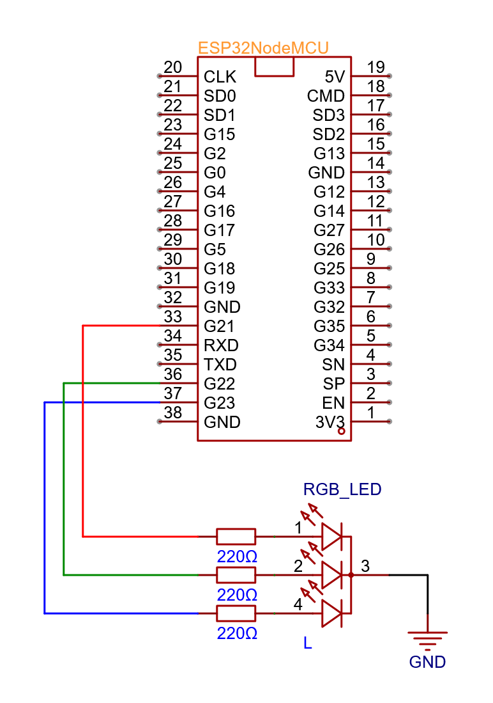

# H-Bridge - PoC
Deze PoC vererifieert de werking van volgende zaken:
- 2 motoren kunnen onafhankelijk van elkaar kunnen draaien
- motoren zijn (traploos) regelbaar in snelheid en draairichting

Bij een correcte werking zal eerst motor 1 traploos versnellen van stilstand tot zijn maximum snelheid, en vervolgens terug vertragen tot stilstand. Motor 2 herhaald deze werking.

https://github.com/user-attachments/assets/0f00047d-495a-4bb4-b6ac-76eb2669470c

## Schema

## Stappenplan
- Sluit de componenten correct aan volgens bovenstaande schema
- Verbind de microcontroller met de pc
- Verify/Upload de code naar de mictrocontroller
- Verifieer de werking door te vergelijken met bovenstaande video
