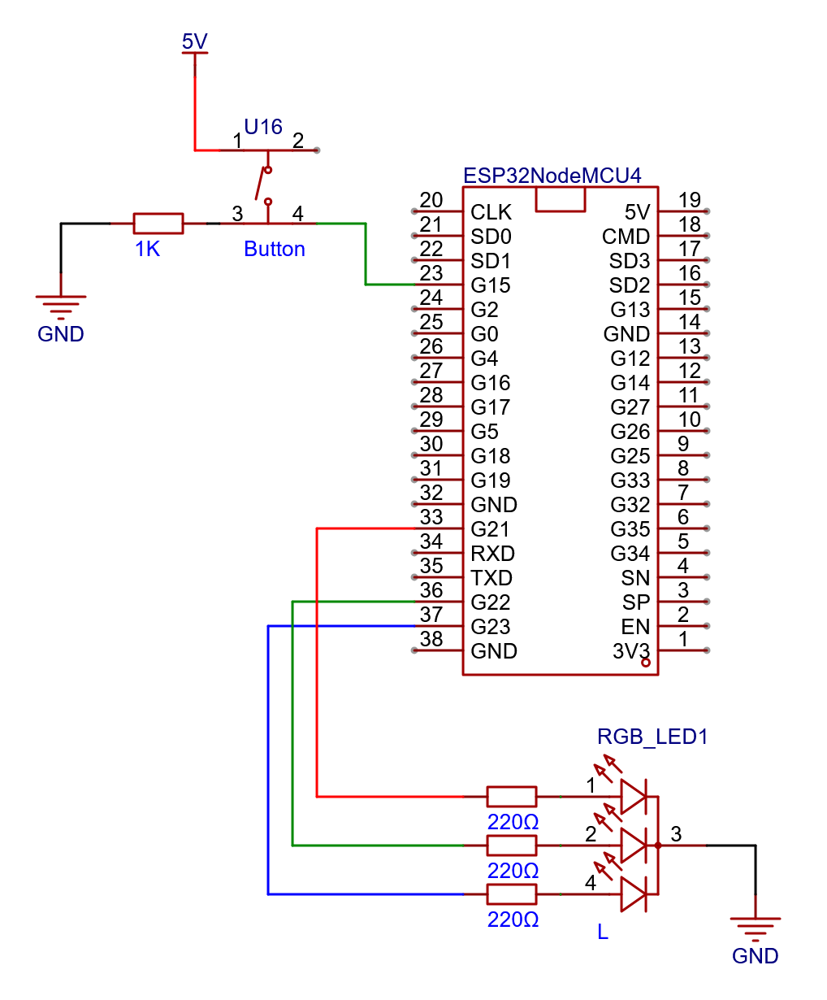

# Interrupt - PoC
Deze PoC vererifieert de werking van volgende zaken:
- start/stop met drukknop
- gebruikmakend van een hardware interrupt

Bij een correcte werking zal de blink cyclus blijven doorlopen, wanneer de drukknop kortstondig word ingedrukt word de cyclus onderbroken en blijft de RGB led op wit. Bij een 2de keer drukken op de drukknop zal de cyclus hervatten

https://github.com/user-attachments/assets/07a7d600-da04-43f0-961d-6ccd3eb3b6cc

## Schema

## Stappenplan
- Sluit de componenten correct aan volgens bovenstaande schema
- Verbind de microcontroller met de pc
- Verify/Upload de code naar de mictrocontroller
- Verifieer de werking door te vergelijken met bovenstaande video
