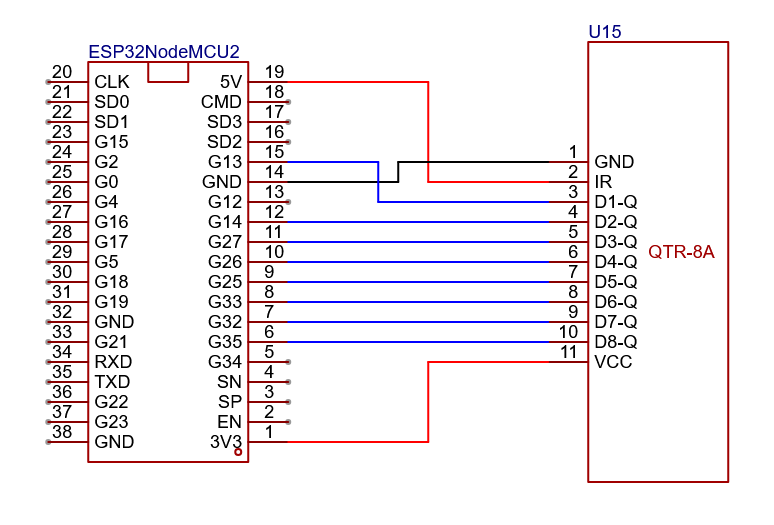

# Sensor - PoC
Deze PoC vererifieert de werking van volgende zaken:
- minimaal 6 sensoren kunnen onafhankelijk van elkaar worden uitgelezen (geen calibratie, normalisatie of interpolatie)
- Hierbij moet een zo groot mogelijk bereik van de AD converter benut worden (indien van toepassing)

Bij een correcte werking zal de sensor een hoge waarde geven bij lichte kleuren (max 4095) en een lage waarde bij donkere kleuren

https://github.com/user-attachments/assets/09217cbb-010d-4b2e-adb0-6ba14c347263

## Schema

## Stappenplan
- Sluit de componenten correct aan volgens bovenstaande schema
- Verbind de microcontroller met de pc
- Verify/Upload de code naar de mictrocontroller
- Verifieer de werking door te vergelijken met bovenstaande video

