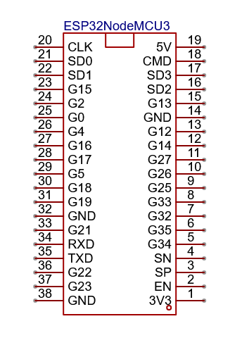

# communicatie - PoC
Deze PoC vererifieert de werking van volgende zaken:
- er kan duplex gecommuniceerd worden tussen de microcontroller en een laptop
- gebruikmaken van PuTTy

Bij een correcte werking zal de seriële monitor berichten ontvangen van PuTTY, en zal PuTTy berichten ontvangen van de seriële monitor.

https://github.com/user-attachments/assets/d7bfd74a-13d0-45ac-b519-173b7eff39de

## Schema

## Stappenplan
- Verbind de microcontroller met de pc
- Verify/Upload de code naar de mictrocontroller
- Controleer of de bibliotheek BluetoothSerial.h is geïnstalleerd
- Verbind met "ESP_BT_DJ" via bluetooth op laptop
- kijk in device manager welke COM word gebruikt door de bluetooth verbinding
- Connecteer via PuTTY met deze seriële COM en stel de correcte baudrate in
- Verifieer de werking door te vergelijken met bovenstaande video
